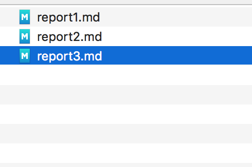
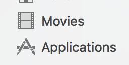

# report2 Subdomain takeover, using yea "ok"

This is cool!



JA:




 

Nice huh?

# Another title

```
 
```

```
---
asset: 'example.com'
weakness: x
severity: high
attachments: ["ok.txt", "ja.csv"]
---
```

```
<video src="ok.mp4" />
```

<video upload src="ok.mp4" />

Yea!

## Impact

This is the impact, go for it!

Regards,
Frans
